# ShareSpace - Individual Use Case UML Diagrams

**Project:** ShareSpace Marketplace  
**Author:** Niraj Yadav  
**Created:** 08/11/25  
**Updated:** 12/11/25

## How to View Traditional UML Diagrams

Your teacher wants **traditional UML notation** like the image you showed. This document provides both:

1. **PlantUML Code** - Renders exactly like traditional UML with proper symbols
2. **Mermaid Code** - Alternative that works in VS Code/GitHub

### To Render PlantUML (Traditional UML):
- **Online**: Copy PlantUML code to http://www.plantuml.com/plantuml/
- **VS Code**: Install "PlantUML" extension by jebbs
- **IntelliJ/Eclipse**: Built-in PlantUML support

### Sample Traditional UML (Like Your Teacher's Example):

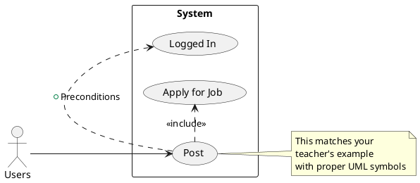
```plantuml
@startuml
left to right direction
skinparam packageStyle rectangle
actor "Users" as Users
rectangle "System" {
  usecase "Post" as Post
  usecase "Apply for Job" as ApplyJob
  usecase "Logged In" as LoggedIn
}

Users --> Post
Post .> LoggedIn : +Preconditions
Post .> ApplyJob : <<include>>

note right of Post : This matches your\nteacher's example\nwith proper UML symbols
@enduml
```

---

## UC1: Student Registration

### Use Case Diagram (PlantUML - Traditional UML)
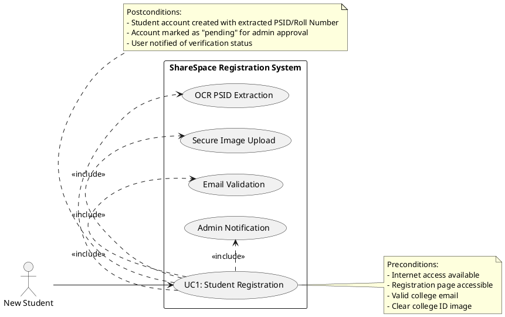
```plantuml
@startuml
left to right direction
skinparam packageStyle rectangle
actor "New Student" as NewStudent
rectangle "ShareSpace Registration System" {
  usecase "UC1: Student Registration" as UC1
  usecase "OCR PSID Extraction" as OCR
  usecase "Secure Image Upload" as Upload  
  usecase "Email Validation" as Validation
  usecase "Admin Notification" as AdminNotify
}

NewStudent --> UC1

UC1 .> OCR : <<include>>
UC1 .> Upload : <<include>>
UC1 .> Validation : <<include>>
UC1 .> AdminNotify : <<include>>

note right of UC1 : Preconditions:\n- Internet access available\n- Registration page accessible\n- Valid college email\n- Clear college ID image

note bottom of UC1 : Postconditions:\n- Student account created with extracted PSID/Roll Number\n- Account marked as "pending" for admin approval\n- User notified of verification status
@enduml
```

### Use Case Diagram (Mermaid Alternative)
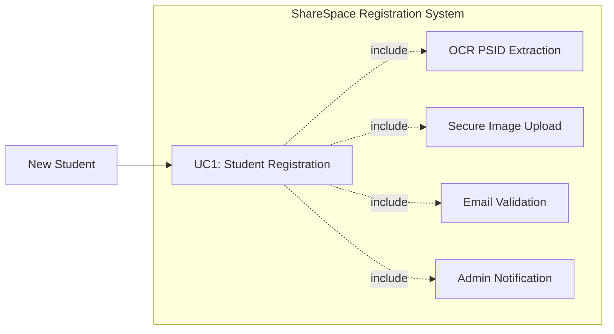
```mermaid
flowchart LR
    NewStudent[New Student]
    
    subgraph System[ShareSpace Registration System]
        UC1[UC1: Student Registration]
        OCR[OCR PSID Extraction]
        Upload[Secure Image Upload]
        Validation[Email Validation]
        AdminNotify[Admin Notification]
    end
    
    NewStudent --> UC1
    UC1 -.->|include| OCR
    UC1 -.->|include| Upload
    UC1 -.->|include| Validation
    UC1 -.->|include| AdminNotify
```

### Sequence Diagram
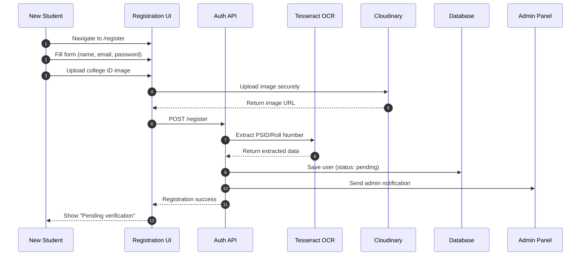
```mermaid
sequenceDiagram
    autonumber
    participant NS as New Student
    participant UI as Registration UI
    participant API as Auth API
    participant OCR as Tesseract OCR
    participant Cloud as Cloudinary
    participant DB as Database
    participant Admin as Admin Panel

    NS->>UI: Navigate to /register
    NS->>UI: Fill form (name, email, password)
    NS->>UI: Upload college ID image
    UI->>Cloud: Upload image securely
    Cloud-->>UI: Return image URL
    UI->>API: POST /register
    API->>OCR: Extract PSID/Roll Number
    OCR-->>API: Return extracted data
    API->>DB: Save user (status: pending)
    API->>Admin: Send admin notification
    API-->>UI: Registration success
    UI-->>NS: Show "Pending verification"
```

### Activity Diagram
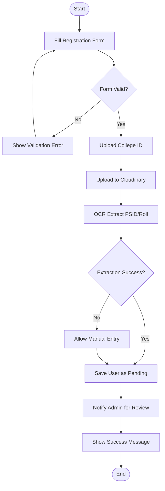
```mermaid
flowchart TD
    Start([Start]) --> Form[Fill Registration Form]
    Form --> ValidateForm{Form Valid?}
    ValidateForm -->|No| ShowError[Show Validation Error]
    ShowError --> Form
    ValidateForm -->|Yes| UploadID[Upload College ID]
    UploadID --> CloudUpload[Upload to Cloudinary]
    CloudUpload --> OCRExtract[OCR Extract PSID/Roll]
    OCRExtract --> OCRSuccess{Extraction Success?}
    OCRSuccess -->|No| ManualEntry[Allow Manual Entry]
    OCRSuccess -->|Yes| SaveUser[Save User as Pending]
    ManualEntry --> SaveUser
    SaveUser --> NotifyAdmin[Notify Admin for Review]
    NotifyAdmin --> Success[Show Success Message]
    Success --> End([End])
```

---

## UC2: Admin Account Verification

### Use Case Diagram (PlantUML - Traditional UML)
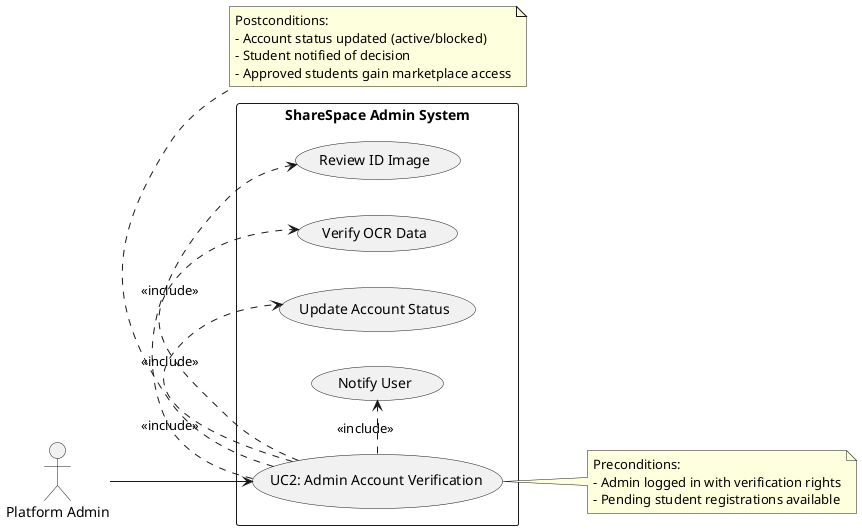
```plantuml
@startuml
left to right direction
skinparam packageStyle rectangle
actor "Platform Admin" as Admin
rectangle "ShareSpace Admin System" {
  usecase "UC2: Admin Account Verification" as UC2
  usecase "Review ID Image" as ReviewID
  usecase "Verify OCR Data" as VerifyOCR
  usecase "Update Account Status" as UpdateStatus
  usecase "Notify User" as NotifyUser
}

Admin --> UC2

UC2 .> ReviewID : <<include>>
UC2 .> VerifyOCR : <<include>>
UC2 .> UpdateStatus : <<include>>
UC2 .> NotifyUser : <<include>>

note right of UC2 : Preconditions:\n- Admin logged in with verification rights\n- Pending student registrations available

note bottom of UC2 : Postconditions:\n- Account status updated (active/blocked)\n- Student notified of decision\n- Approved students gain marketplace access
@enduml
```

### Use Case Diagram (Mermaid Alternative)
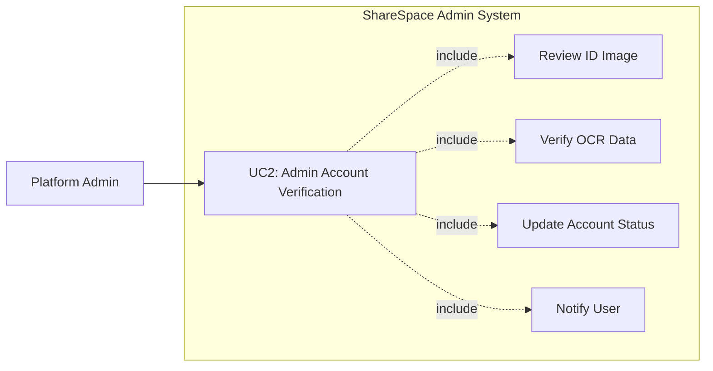
```mermaid
flowchart LR
    Admin[Platform Admin]
    
    subgraph System[ShareSpace Admin System]
        UC2[UC2: Admin Account Verification]
        ReviewID[Review ID Image]
        VerifyOCR[Verify OCR Data]
        UpdateStatus[Update Account Status]
        NotifyUser[Notify User]
    end
    
    Admin --> UC2
    UC2 -.->|include| ReviewID
    UC2 -.->|include| VerifyOCR
    UC2 -.->|include| UpdateStatus
    UC2 -.->|include| NotifyUser
```

### Sequence Diagram
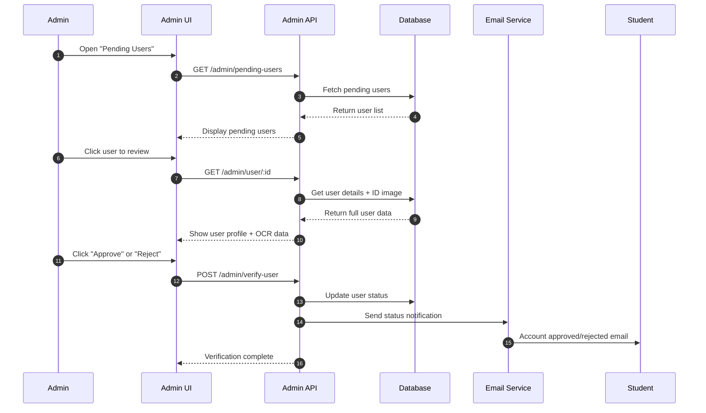
```mermaid
sequenceDiagram
    autonumber
    participant A as Admin
    participant UI as Admin UI
    participant API as Admin API
    participant DB as Database
    participant Email as Email Service
    participant Student as Student

    A->>UI: Open "Pending Users"
    UI->>API: GET /admin/pending-users
    API->>DB: Fetch pending users
    DB-->>API: Return user list
    API-->>UI: Display pending users
    A->>UI: Click user to review
    UI->>API: GET /admin/user/:id
    API->>DB: Get user details + ID image
    DB-->>API: Return full user data
    API-->>UI: Show user profile + OCR data
    A->>UI: Click "Approve" or "Reject"
    UI->>API: POST /admin/verify-user
    API->>DB: Update user status
    API->>Email: Send status notification
    Email->>Student: Account approved/rejected email
    API-->>UI: Verification complete
```

### Activity Diagram
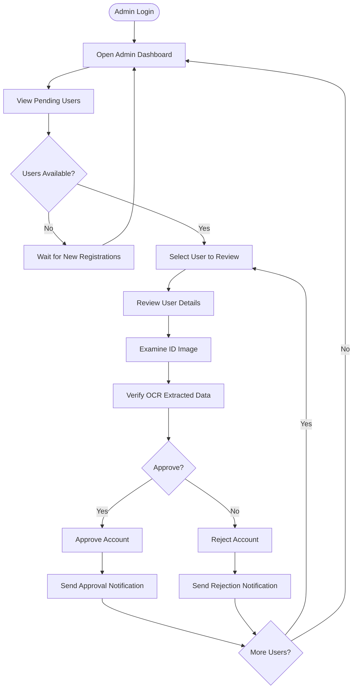
```mermaid
flowchart TD
    Start([Admin Login]) --> Dashboard[Open Admin Dashboard]
    Dashboard --> PendingUsers[View Pending Users]
    PendingUsers --> HasUsers{Users Available?}
    HasUsers -->|No| Wait[Wait for New Registrations]
    HasUsers -->|Yes| SelectUser[Select User to Review]
    SelectUser --> ReviewDetails[Review User Details]
    ReviewDetails --> CheckID[Examine ID Image]
    CheckID --> VerifyOCR[Verify OCR Extracted Data]
    VerifyOCR --> Decision{Approve?}
    Decision -->|Yes| Approve[Approve Account]
    Decision -->|No| Reject[Reject Account]
    Approve --> NotifyApproval[Send Approval Notification]
    Reject --> NotifyRejection[Send Rejection Notification]
    NotifyApproval --> NextUser{More Users?}
    NotifyRejection --> NextUser
    NextUser -->|Yes| SelectUser
    NextUser -->|No| Dashboard
    Wait --> Dashboard
```

---

## UC3: Student Login

### Use Case Diagram (PlantUML - Traditional UML)
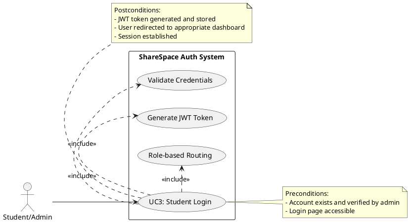
```plantuml
@startuml
left to right direction
skinparam packageStyle rectangle
actor "Student/Admin" as Student
rectangle "ShareSpace Auth System" {
  usecase "UC3: Student Login" as UC3
  usecase "Validate Credentials" as ValidateCredentials
  usecase "Generate JWT Token" as GenerateJWT
  usecase "Role-based Routing" as RoleRouting
}

Student --> UC3

UC3 .> ValidateCredentials : <<include>>
UC3 .> GenerateJWT : <<include>>
UC3 .> RoleRouting : <<include>>

note right of UC3 : Preconditions:\n- Account exists and verified by admin\n- Login page accessible

note bottom of UC3 : Postconditions:\n- JWT token generated and stored\n- User redirected to appropriate dashboard\n- Session established
@enduml
```

### Use Case Diagram (Mermaid Alternative)
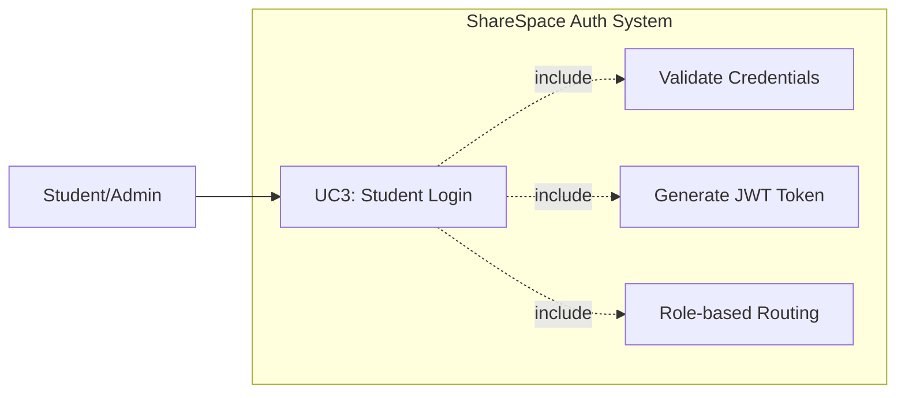
```mermaid
flowchart LR
    Student[Student/Admin]
    
    subgraph System[ShareSpace Auth System]
        UC3[UC3: Student Login]
        ValidateCredentials[Validate Credentials]
        GenerateJWT[Generate JWT Token]
        RoleRouting[Role-based Routing]
    end
    
    Student --> UC3
    UC3 -.->|include| ValidateCredentials
    UC3 -.->|include| GenerateJWT
    UC3 -.->|include| RoleRouting
```

### Sequence Diagram
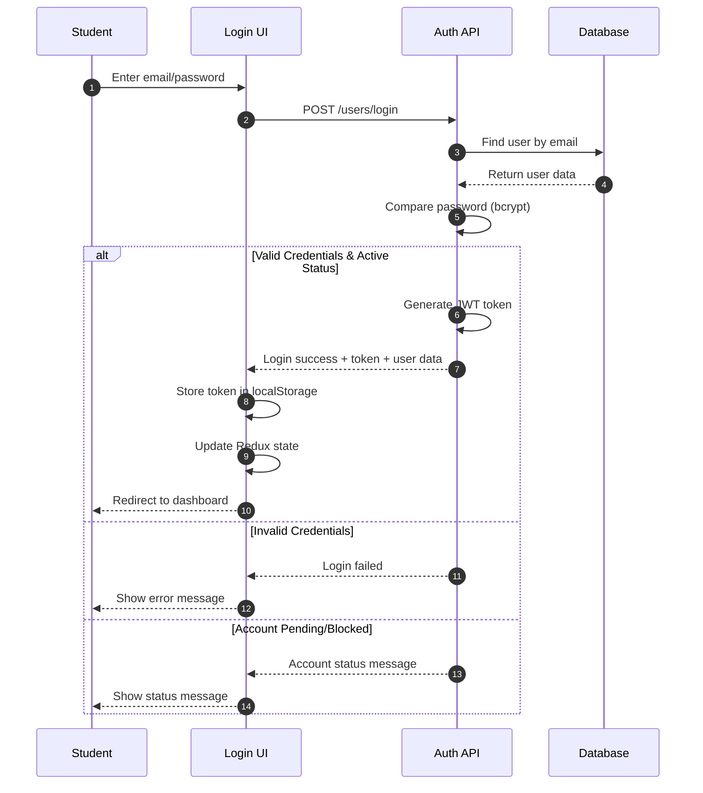
```mermaid
sequenceDiagram
    autonumber
    participant S as Student
    participant UI as Login UI
    participant API as Auth API
    participant DB as Database

    S->>UI: Enter email/password
    UI->>API: POST /users/login
    API->>DB: Find user by email
    DB-->>API: Return user data
    API->>API: Compare password (bcrypt)
    alt Valid Credentials & Active Status
        API->>API: Generate JWT token
        API-->>UI: Login success + token + user data
        UI->>UI: Store token in localStorage
        UI->>UI: Update Redux state
        UI-->>S: Redirect to dashboard
    else Invalid Credentials
        API-->>UI: Login failed
        UI-->>S: Show error message
    else Account Pending/Blocked
        API-->>UI: Account status message
        UI-->>S: Show status message
    end
```

### Activity Diagram
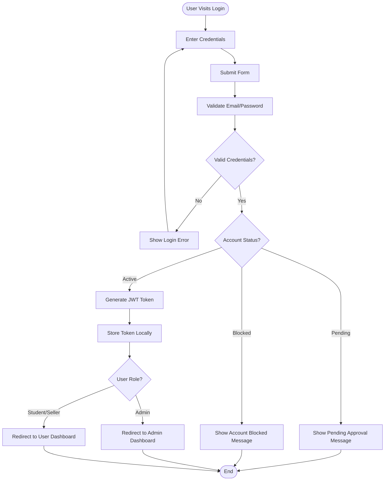
```mermaid
flowchart TD
    Start([User Visits Login]) --> LoginForm[Enter Credentials]
    LoginForm --> Submit[Submit Form]
    Submit --> Validate[Validate Email/Password]
    Validate --> ValidCreds{Valid Credentials?}
    ValidCreds -->|No| LoginError[Show Login Error]
    LoginError --> LoginForm
    ValidCreds -->|Yes| CheckStatus{Account Status?}
    CheckStatus -->|Pending| PendingMsg[Show Pending Approval Message]
    CheckStatus -->|Blocked| BlockedMsg[Show Account Blocked Message]
    CheckStatus -->|Active| GenerateToken[Generate JWT Token]
    GenerateToken --> StoreToken[Store Token Locally]
    StoreToken --> CheckRole{User Role?}
    CheckRole -->|Admin| AdminDashboard[Redirect to Admin Dashboard]
    CheckRole -->|Student/Seller| UserDashboard[Redirect to User Dashboard]
    PendingMsg --> End([End])
    BlockedMsg --> End
    AdminDashboard --> End
    UserDashboard --> End
```

---

## UC4: Password Recovery

### Use Case Diagram
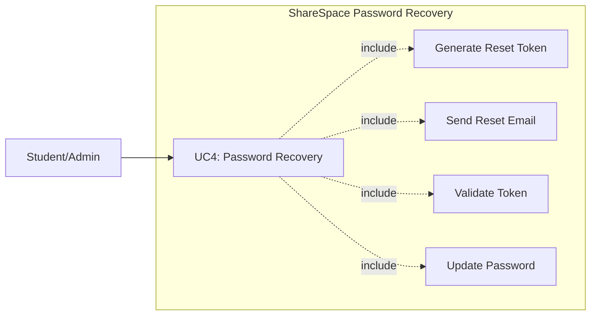
```mermaid
flowchart LR
    User[Student/Admin]
    
    subgraph System[ShareSpace Password Recovery]
        UC4[UC4: Password Recovery]
        GenerateToken[Generate Reset Token]
        SendEmail[Send Reset Email]
        ValidateToken[Validate Token]
        UpdatePassword[Update Password]
    end
    
    User --> UC4
    UC4 -.->|include| GenerateToken
    UC4 -.->|include| SendEmail
    UC4 -.->|include| ValidateToken
    UC4 -.->|include| UpdatePassword
```

### Sequence Diagram
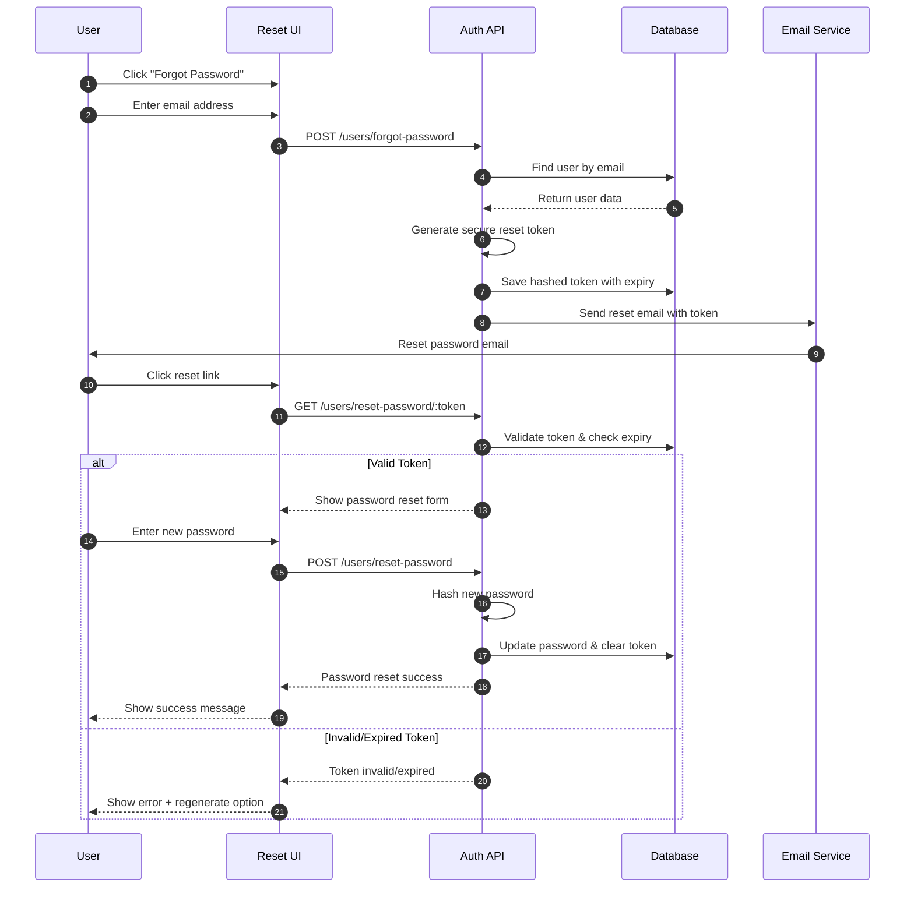
```mermaid
sequenceDiagram
    autonumber
    participant U as User
    participant UI as Reset UI
    participant API as Auth API
    participant DB as Database
    participant Email as Email Service

    U->>UI: Click "Forgot Password"
    U->>UI: Enter email address
    UI->>API: POST /users/forgot-password
    API->>DB: Find user by email
    DB-->>API: Return user data
    API->>API: Generate secure reset token
    API->>DB: Save hashed token with expiry
    API->>Email: Send reset email with token
    Email->>U: Reset password email
    U->>UI: Click reset link
    UI->>API: GET /users/reset-password/:token
    API->>DB: Validate token & check expiry
    alt Valid Token
        API-->>UI: Show password reset form
        U->>UI: Enter new password
        UI->>API: POST /users/reset-password
        API->>API: Hash new password
        API->>DB: Update password & clear token
        API-->>UI: Password reset success
        UI-->>U: Show success message
    else Invalid/Expired Token
        API-->>UI: Token invalid/expired
        UI-->>U: Show error + regenerate option
    end
```

### Activity Diagram
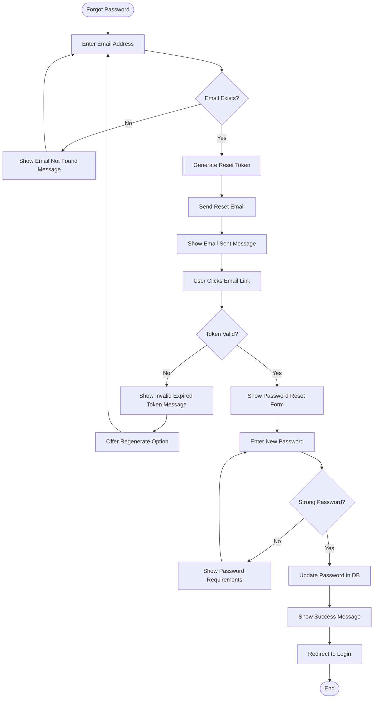
```mermaid
flowchart TD
    Start([Forgot Password]) --> EnterEmail[Enter Email Address]
    EnterEmail --> CheckEmail{Email Exists?}
    CheckEmail -->|No| EmailError[Show Email Not Found Message]
    EmailError --> EnterEmail
    CheckEmail -->|Yes| GenerateToken[Generate Reset Token]
    GenerateToken --> SendEmail[Send Reset Email]
    SendEmail --> EmailSent[Show Email Sent Message]
    EmailSent --> ClickLink[User Clicks Email Link]
    ClickLink --> ValidateToken{Token Valid?}
    ValidateToken -->|No| TokenError[Show Invalid Expired Token Message]
    TokenError --> RegenerateOption[Offer Regenerate Option]
    ValidateToken -->|Yes| ResetForm[Show Password Reset Form]
    ResetForm --> EnterNewPassword[Enter New Password]
    EnterNewPassword --> ValidatePassword{Strong Password?}
    ValidatePassword -->|No| PasswordError[Show Password Requirements]
    PasswordError --> EnterNewPassword
    ValidatePassword -->|Yes| UpdatePassword[Update Password in DB]
    UpdatePassword --> Success[Show Success Message]
    Success --> RedirectLogin[Redirect to Login]
    RegenerateOption --> EnterEmail
    RedirectLogin --> End([End])
```

---

## UC5: Browse Products

### Use Case Diagram
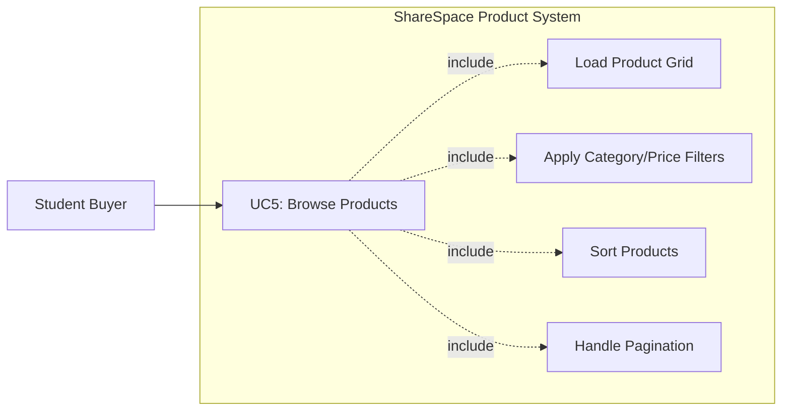
```mermaid
flowchart LR
    Buyer[Student Buyer]
    
    subgraph System[ShareSpace Product System]
        UC5[UC5: Browse Products]
        LoadProducts[Load Product Grid]
        ApplyFilters[Apply Category/Price Filters]
        SortProducts[Sort Products]
        ViewPagination[Handle Pagination]
    end
    
    Buyer --> UC5
    UC5 -.->|include| LoadProducts
    UC5 -.->|include| ApplyFilters
    UC5 -.->|include| SortProducts
    UC5 -.->|include| ViewPagination
```

### Sequence Diagram
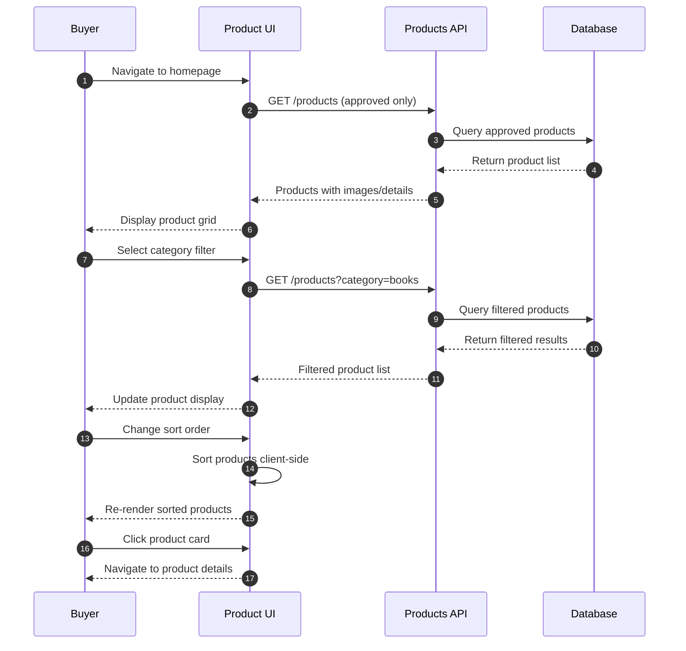
```mermaid
sequenceDiagram
    autonumber
    participant B as Buyer
    participant UI as Product UI
    participant API as Products API
    participant DB as Database

    B->>UI: Navigate to homepage
    UI->>API: GET /products (approved only)
    API->>DB: Query approved products
    DB-->>API: Return product list
    API-->>UI: Products with images/details
    UI-->>B: Display product grid
    
    B->>UI: Select category filter
    UI->>API: GET /products?category=books
    API->>DB: Query filtered products
    DB-->>API: Return filtered results
    API-->>UI: Filtered product list
    UI-->>B: Update product display
    
    B->>UI: Change sort order
    UI->>UI: Sort products client-side
    UI-->>B: Re-render sorted products
    
    B->>UI: Click product card
    UI-->>B: Navigate to product details
```

### Activity Diagram
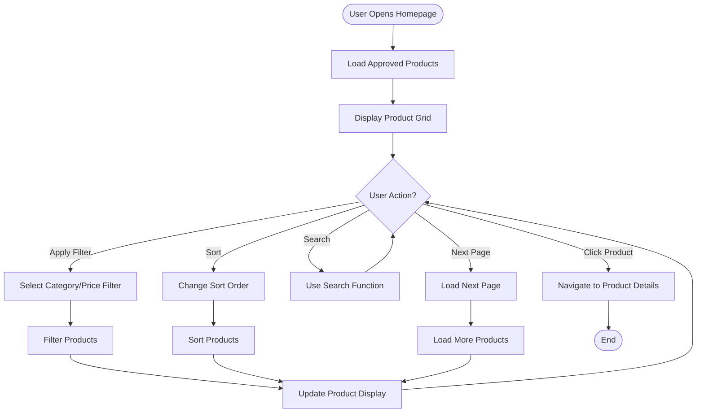
```mermaid
flowchart TD
    Start([User Opens Homepage]) --> LoadProducts[Load Approved Products]
    LoadProducts --> DisplayGrid[Display Product Grid]
    DisplayGrid --> UserAction{User Action?}
    
    UserAction -->|Apply Filter| SelectFilter[Select Category/Price Filter]
    UserAction -->|Sort| ChangeSort[Change Sort Order]
    UserAction -->|Search| SearchProducts[Use Search Function]
    UserAction -->|Click Product| ViewDetails[Navigate to Product Details]
    UserAction -->|Next Page| NextPage[Load Next Page]
    
    SelectFilter --> FilterProducts[Filter Products]
    FilterProducts --> UpdateDisplay[Update Product Display]
    
    ChangeSort --> SortProducts[Sort Products]
    SortProducts --> UpdateDisplay
    
    NextPage --> LoadMoreProducts[Load More Products]
    LoadMoreProducts --> UpdateDisplay
    
    UpdateDisplay --> UserAction
    SearchProducts --> UserAction
    ViewDetails --> End([End])
```

---

## UC6: Search Products

### Use Case Diagram
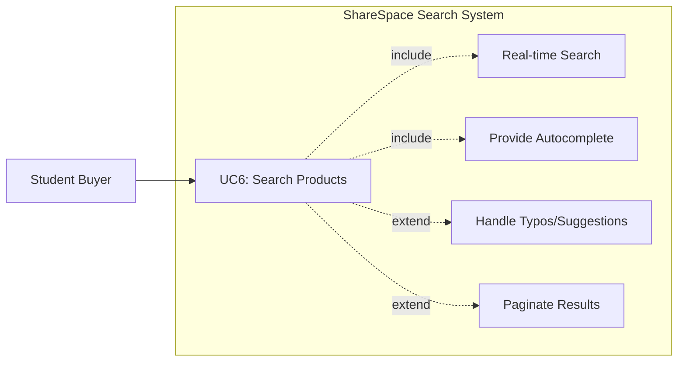
```mermaid
flowchart LR
    Buyer[Student Buyer]
    
    subgraph System[ShareSpace Search System]
        UC6[UC6: Search Products]
        RealTimeSearch[Real-time Search]
        Autocomplete[Provide Autocomplete]
        HandleTypos[Handle Typos/Suggestions]
        Pagination[Paginate Results]
    end
    
    Buyer --> UC6
    UC6 -.->|include| RealTimeSearch
    UC6 -.->|include| Autocomplete
    UC6 -.->|extend| HandleTypos
    UC6 -.->|extend| Pagination
```

### Sequence Diagram
```mermaid
sequenceDiagram
    autonumber
    participant B as Buyer
    participant UI as Search UI
    participant API as Search API
    participant DB as Database

    B->>UI: Type search query
    UI->>UI: Debounce input (300ms)
    UI->>API: GET /search/autocomplete?q=laptop
    API->>DB: Query product names/descriptions
    DB-->>API: Return autocomplete suggestions
    API-->>UI: Suggestion list
    UI-->>B: Show autocomplete dropdown
    
    B->>UI: Press Enter or select suggestion
    UI->>API: GET /search?q=laptop&page=1
    API->>DB: Full-text search on products
    DB-->>API: Return matching products
    
    alt Results Found
        API-->>UI: Product results + pagination
        UI-->>B: Display search results
    else No Results
        API->>DB: Generate suggestions
        DB-->>API: Similar/alternative products
        API-->>UI: Empty results + suggestions
        UI-->>B: Show "No results" + suggestions
    else Search Error
        API-->>UI: Search service error
        UI-->>B: Show error message + retry
    end
```

### Activity Diagram
```mermaid
flowchart TD
    Start([User Enters Search]) --> TypeQuery[Type Search Query]
    TypeQuery --> Debounce{Debounce Complete?}
    Debounce -->|No| TypeQuery
    Debounce -->|Yes| ShowAutocomplete[Show Autocomplete]
    ShowAutocomplete --> UserChoice{User Action?}
    
    UserChoice -->|Continue Typing| TypeQuery
    UserChoice -->|Select Suggestion| ExecuteSearch[Execute Search]
    UserChoice -->|Press Enter| ExecuteSearch
    
    ExecuteSearch --> SearchDB[Search Database]
    SearchDB --> HasResults{Results Found?}
    
    HasResults -->|Yes| DisplayResults[Display Search Results]
    HasResults -->|No| ShowSuggestions[Show Alternative Suggestions]
    
    DisplayResults --> ResultActions{User Action?}
    ResultActions -->|Apply Filters| FilterResults[Apply Additional Filters]
    ResultActions -->|Next Page| LoadNextPage[Load Next Page]
    ResultActions -->|Select Product| ViewProduct[View Product Details]
    ResultActions -->|New Search| TypeQuery
    
    FilterResults --> DisplayResults
    LoadNextPage --> DisplayResults
    ShowSuggestions --> TypeQuery
    ViewProduct --> End([End])
```

---

## UC7: View Product Details

### Use Case Diagram
```mermaid
flowchart LR
    Buyer[Student Buyer]
    
    subgraph System[ShareSpace Product Detail System]
        UC7[UC7: View Product Details]
        LoadDetails[Load Product Info]
        ViewImages[Display Image Gallery]
        ShowBidInfo[Show Bid Information]
        SellerInfo[Display Seller Info]
        BidInterface[Provide Bid Interface]
    end
    
    Buyer --> UC7
    UC7 -.->|include| LoadDetails
    UC7 -.->|include| ViewImages
    UC7 -.->|include| ShowBidInfo
    UC7 -.->|include| SellerInfo
    UC7 -.->|extend| BidInterface
```

### Sequence Diagram
```mermaid
sequenceDiagram
    autonumber
    participant B as Buyer
    participant UI as Product UI
    participant API as Products API
    participant DB as Database

    B->>UI: Click product from grid/search
    UI->>API: GET /products/:productId
    API->>DB: Query product details
    DB-->>API: Return product data + seller info
    API-->>UI: Product details + images
    UI-->>B: Display product page
    
    UI->>API: GET /bids/get-bids/:productId
    API->>DB: Query bids for product
    DB-->>API: Return bid count + status info
    API-->>UI: Bid information (privacy protected)
    UI-->>B: Show bid count + status
    
    alt User is not seller & bidding open
        UI-->>B: Show "Place Bid" button
        B->>UI: Click "Place Bid"
        UI-->>B: Open bid modal
    else User is seller or bidding closed
        UI-->>B: Show "Bidding Closed" or seller view
    end
```

### Activity Diagram
```mermaid
flowchart TD
    Start([Click Product]) --> LoadProduct[Load Product Details]
    LoadProduct --> LoadImages[Load Product Images]
    LoadImages --> LoadBids[Load Bid Information]
    LoadBids --> CheckUser{User Type?}
    
    CheckUser -->|Seller| SellerView[Show Seller View]
    CheckUser -->|Buyer| BuyerView[Show Buyer View]
    
    SellerView --> ShowAllBids[Show All Received Bids]
    ShowAllBids --> ManageBids[Provide Bid Management]
    
    BuyerView --> CheckBidStatus{Bidding Status?}
    CheckBidStatus -->|Open| ShowBidButton[Show Place Bid Button]
    CheckBidStatus -->|Closed| ShowClosedNotice[Show Bidding Closed Notice]
    
    ShowBidButton --> UserAction{User Action?}
    UserAction -->|Place Bid| OpenBidModal[Open Bid Modal]
    UserAction -->|View Images| ImageGallery[Open Image Gallery]
    UserAction -->|Back| BackToListing[Return to Product Listing]
    
    OpenBidModal --> PlaceBid[Place Bid Process]
    ImageGallery --> UserAction
    ManageBids --> SellerActions[Seller Bid Management]
    ShowClosedNotice --> UserAction
    
    PlaceBid --> End([End])
    BackToListing --> End
    SellerActions --> End
```

---

## UC8: Place Competitive Bid

### Use Case Diagram
```mermaid
flowchart LR
    Buyer[Student Buyer]
    
    subgraph System[ShareSpace Bidding System]
        UC8[UC8: Place Competitive Bid]
        ValidateBid[Validate Bid Data]
        CheckDuplicate[Check Duplicate Bids]
        SaveBid[Save Bid to Database]
        NotifySeller[Notify Seller]
        SendConfirmation[Send Bid Confirmation]
    end
    
    Buyer --> UC8
    UC8 -.->|include| ValidateBid
    UC8 -.->|include| CheckDuplicate
    UC8 -.->|include| SaveBid
    UC8 -.->|include| NotifySeller
    UC8 -.->|include| SendConfirmation
```

### Sequence Diagram
```mermaid
sequenceDiagram
    autonumber
    participant B as Buyer
    participant UI as Bid UI
    participant API as Bids API
    participant DB as Database
    participant Notify as Notification Service
    participant S as Seller

    B->>UI: Click "Place Bid" button
    UI-->>B: Open bid modal/form
    B->>UI: Fill bid form (amount, message, mobile)
    UI->>API: POST /bids/place-bid
    API->>DB: Check for existing bid by user
    
    alt No existing bid found
        API->>API: Validate bid amount & data
        API->>DB: Save new bid (status: pending)
        DB-->>API: Bid saved successfully
        API->>Notify: Create seller notification
        Notify->>S: "New bid received" notification
        API-->>UI: Bid placed successfully
        UI-->>B: Show success message + bid tracking
    else Duplicate bid exists
        API-->>UI: Duplicate bid error
        UI-->>B: Show "You already have a pending bid"
    else Bidding closed
        API-->>UI: Bidding closed error
        UI-->>B: Show "Bidding is closed for this product"
    end
```

### Activity Diagram
```mermaid
flowchart TD
    Start([Click Place Bid]) --> CheckLogin{User Logged In?}
    CheckLogin -->|No| RedirectLogin[Redirect to Login]
    CheckLogin -->|Yes| OpenBidForm[Open Bid Form Modal]
    
    OpenBidForm --> FillForm[Fill Bid Details]
    FillForm --> ValidateForm{Form Valid?}
    ValidateForm -->|No| ShowValidationError[Show Validation Error]
    ShowValidationError --> FillForm
    
    ValidateForm -->|Yes| CheckExistingBid{Existing Bid?}
    CheckExistingBid -->|Yes| ShowDuplicateError[Show Already Bid Message]
    CheckExistingBid -->|No| CheckBiddingStatus{Bidding Open?}
    
    CheckBiddingStatus -->|No| ShowClosedError[Show Bidding Closed Message]
    CheckBiddingStatus -->|Yes| SaveBid[Save Bid to Database]
    
    SaveBid --> NotifySeller[Notify Seller]
    NotifySeller --> ShowSuccess[Show Success Message]
    ShowSuccess --> UpdateUI[Update Product Page UI]
    UpdateUI --> TrackBid[Add to My Bids Tracking]
    
    ShowDuplicateError --> CloseModal[Close Modal]
    ShowClosedError --> CloseModal
    RedirectLogin --> End([End])
    CloseModal --> End
    TrackBid --> End
```

---

## UC9: Track Bid Status

### Use Case Diagram
```mermaid
flowchart LR
    Buyer[Student Buyer]
    
    subgraph System[ShareSpace Bid Tracking]
        UC9[UC9: Track Bid Status]
        LoadUserBids[Load User's Bids]
        ShowStatusBadges[Display Status Badges]
        RealTimeUpdates[Real-time Status Updates]
        ProductNavigation[Navigate to Product]
    end
    
    Buyer --> UC9
    UC9 -.->|include| LoadUserBids
    UC9 -.->|include| ShowStatusBadges
    UC9 -.->|include| RealTimeUpdates
    UC9 -.->|include| ProductNavigation
```

### Sequence Diagram
```mermaid
sequenceDiagram
    autonumber
    participant B as Buyer
    participant UI as Profile UI
    participant API as Bids API
    participant DB as Database

    B->>UI: Click "My Bids" tab
    UI->>API: GET /bids/get-bids-by-buyer
    API->>DB: Query bids by buyerId
    DB-->>API: Return bid list with product info
    API-->>UI: Bid history with status
    UI-->>B: Display bid tracking table
    
    loop Real-time Updates
        UI->>API: GET /bids/get-bids-by-buyer (polling)
        API->>DB: Check for status changes
        alt Status Changed
            DB-->>API: Updated bid status
            API-->>UI: New status data
            UI-->>B: Update status badge + notification
        else No Changes
            DB-->>API: Same status
            API-->>UI: No updates
        end
    end
    
    B->>UI: Click "View Product" link
    UI-->>B: Navigate to product details
```

### Activity Diagram
```mermaid
flowchart TD
    Start([Open My Bids]) --> LoadBids[Load User Bid History]
    LoadBids --> HasBids{Bids Exist?}
    
    HasBids -->|No| ShowEmptyState[Show No Bids Message]
    HasBids -->|Yes| DisplayBidTable[Display Bid Tracking Table]
    
    DisplayBidTable --> ShowStatus[Show Status Badges]
    ShowStatus --> EnableActions[Enable Available Actions]
    EnableActions --> UserAction{User Action?}
    
    UserAction -->|View Product| NavigateToProduct[Open Product Details]
    UserAction -->|Refresh| RefreshBids[Refresh Bid Status]
    UserAction -->|Filter| FilterBids[Filter by Status]
    UserAction -->|Sort| SortBids[Sort by Date/Amount]
    
    RefreshBids --> CheckUpdates[Check for Status Updates]
    CheckUpdates --> HasUpdates{Status Changed?}
    HasUpdates -->|Yes| UpdateDisplay[Update Status Display]
    HasUpdates -->|No| NoChanges[No Changes to Display]
    
    UpdateDisplay --> ShowNotification[Show Status Change Notification]
    ShowNotification --> UserAction
    NoChanges --> UserAction
    FilterBids --> DisplayBidTable
    SortBids --> DisplayBidTable
    
    ShowEmptyState --> PromptToBrowse[Suggest Browse Products]
    PromptToBrowse --> End([End])
    NavigateToProduct --> End
```

## Complete Use Case Diagram

```mermaid
flowchart TD
    %% Actors
    NewStudent[New Student]
    Student[Student<br/>Buyer/Seller]
    Admin[Platform Admin]
    
    %% System Boundary
    subgraph ShareSpace["📚 ShareSpace System"]
        %% Authentication & Registration
        UC1[UC1: Student Registration]
        UC2[UC2: Admin Account Verification]
        UC3[UC3: Student Login]
        UC4[UC4: Password Recovery]
        
        %% Product Discovery
        UC5[UC5: Browse Products]
        UC6[UC6: Search Products]
        UC7[UC7: View Product Details]
        
        %% Bidding System
        UC8[UC8: Place Competitive Bid]
        UC9[UC9: Track Bid Status]
        UC13[UC13: Bid Response Management]
        UC14[UC14: View Received Bids]
        
        %% Product Management
        UC10[UC10: Add Product Listing]
        UC11[UC11: Upload Product Images]
        UC12[UC12: Manage Product Listings]
        
        %% Notifications & Admin
        UC15[UC15: Receive Notifications]
        UC16[UC16: Admin User Verification]
        UC17[UC17: Admin Product Moderation]
        
        %% Included Services
        OCR[OCR Validation]
        EmailNotify[Email Notifications]
        ImageUpload[Image Upload]
        RealTimeSearch[Real-time Search]
    end
    
    %% Actor-Use Case Relationships
    NewStudent --> UC1
    Student --> UC3
    Student --> UC4
    Student --> UC5
    Student --> UC6
    Student --> UC7
    Student --> UC8
    Student --> UC9
    Student --> UC10
    Student --> UC11
    Student --> UC12
    Student --> UC13
    Student --> UC14
    Student --> UC15
    
    Admin --> UC2
    Admin --> UC3
    Admin --> UC15
    Admin --> UC16
    Admin --> UC17
    
    %% Include Relationships
    UC1 -.->|include| OCR
    UC1 -.->|include| EmailNotify
    UC2 -.->|include| EmailNotify
    UC4 -.->|include| EmailNotify
    UC6 -.->|include| RealTimeSearch
    UC10 -.->|include| ImageUpload
    UC11 -.->|include| ImageUpload
    UC8 -.->|include| EmailNotify
    UC13 -.->|include| EmailNotify
```

## Sequence Diagram - Student Registration with OCR

```mermaid
sequenceDiagram
    autonumber
    participant S as New Student
    participant UI as Registration UI
    participant API as Auth API
    participant OCR as OCR Service
    participant Cloud as Cloudinary
    participant DB as Database
    participant Admin as Admin Panel
    participant Email as Email Service

    S->>UI: Navigate to registration
    S->>UI: Fill form (name, email, password)
    S->>UI: Upload college ID image
    UI->>Cloud: Upload image
    Cloud-->>UI: Return image URL
    UI->>API: POST /register (data + imageURL)
    API->>OCR: Extract PSID/Roll Number
    OCR-->>API: Return extracted data
    API->>DB: Save user (status: pending)
    DB-->>API: User created
    API->>Admin: Notify admin for verification
    API-->>UI: Registration successful
    UI-->>S: Show "Pending verification" message
    
    Note over Admin: Admin reviews and approves
    Admin->>API: Approve user
    API->>DB: Update status to active
    API->>Email: Send approval notification
    Email->>S: Account activated email
```

## Sequence Diagram - Bidding Process

```mermaid
sequenceDiagram
    autonumber
    participant B as Buyer
    participant S as Seller
    participant UI as Product UI
    participant API as Bids API
    participant DB as Database
    participant N as Notification Service

    B->>UI: View product details
    B->>UI: Click "Place Bid"
    B->>UI: Fill bid form (amount, message, mobile)
    UI->>API: POST /bids/place-bid
    API->>DB: Check for existing bid
    DB-->>API: No existing bid found
    API->>DB: Save new bid (status: pending)
    API->>N: Notify seller of new bid
    N->>S: "New bid received" notification
    API-->>UI: Bid placed successfully
    UI-->>B: Show success message

    Note over S: Seller reviews bid
    S->>UI: Open bid management
    S->>UI: Accept bid
    UI->>API: POST /bids/respond-to-bid
    API->>DB: Update bid status to accepted
    API->>DB: Close bidding for product
    API->>N: Notify buyer of acceptance
    API->>N: Notify admin of transaction
    N->>B: "Bid accepted" notification
    N->>Admin: "Transaction completed" notification
```

## Activity Diagram - Complete User Journey

```mermaid
flowchart TD
    Start([New User Visits]) --> RegCheck{Has Account?}
    RegCheck -->|No| Register[UC1: Student Registration]
    RegCheck -->|Yes| Login[UC3: Student Login]
    
    Register --> OCRProcess[OCR ID Extraction]
    OCRProcess --> PendingStatus[Account Pending]
    PendingStatus --> AdminReview[UC2: Admin Verification]
    AdminReview --> Approved{Approved?}
    Approved -->|Yes| Login
    Approved -->|No| Rejected[Account Rejected]
    
    Login --> Dashboard[User Dashboard]
    Dashboard --> Action{Choose Action}
    
    Action -->|Browse| Browse[UC5: Browse Products]
    Action -->|Search| Search[UC6: Search Products]
    Action -->|Add Product| AddProduct[UC10: Add Product Listing]
    Action -->|My Bids| ViewBids[UC9: Track Bid Status]
    Action -->|My Products| ManageProducts[UC12: Manage Product Listings]
    
    Browse --> ViewProduct[UC7: View Product Details]
    Search --> ViewProduct
    ViewProduct --> PlaceBid[UC8: Place Competitive Bid]
    PlaceBid --> BidPlaced[Bid Submitted]
    
    AddProduct --> UploadImages[UC11: Upload Product Images]
    UploadImages --> ProductPending[Product Pending Approval]
    ProductPending --> AdminProductReview[UC17: Admin Product Moderation]
    AdminProductReview --> ProductApproved{Approved?}
    ProductApproved -->|Yes| ProductLive[Product Live on Homepage]
    ProductApproved -->|No| ProductRejected[Product Rejected]
    
    ProductLive --> ReceiveBids[UC14: View Received Bids]
    ReceiveBids --> RespondToBid[UC13: Bid Response Management]
    RespondToBid --> BidAccepted[Transaction Complete]
    
    BidPlaced --> Notifications[UC15: Receive Notifications]
    BidAccepted --> Notifications
    ProductLive --> Notifications
    
    Notifications --> Dashboard
    BidAccepted --> End([End])
    Rejected --> End
    ProductRejected --> Dashboard
```

## Class Diagram - Complete Domain Model

```mermaid
classDiagram
    class User {
        +ObjectId _id
        +String name
        +String email
        +String password
        +String mobile
        +String rollNo
        +String psid
        +String role
        +String status
        +String profilePicture
        +Date createdAt
        +Date updatedAt
        +register()
        +login()
        +forgotPassword()
        +resetPassword()
        +updateProfile()
        +uploadProfilePic()
    }
    
    class Product {
        +ObjectId _id
        +String name
        +String description
        +Number price
        +String category
        +String condition
        +String ageCategory
        +String status
        +ObjectId sellerId
        +String[] images
        +Boolean showBidsOnProductPage
        +Date createdAt
        +Date updatedAt
        +addProduct()
        +updateProduct()
        +deleteProduct()
        +uploadImages()
        +moderateProduct()
    }
    
    class Bid {
        +ObjectId _id
        +ObjectId productId
        +ObjectId buyerId
        +Number bidAmount
        +String message
        +String mobile
        +String status
        +String sellerResponse
        +Date createdAt
        +Date respondedAt
        +placeBid()
        +acceptBid()
        +rejectBid()
        +trackStatus()
    }
    
    class Notification {
        +ObjectId _id
        +ObjectId userId
        +String title
        +String message
        +String onClick
        +Boolean read
        +Date createdAt
        +sendNotification()
        +markAsRead()
        +deleteNotification()
    }
    
    class OCRService {
        +extractPSID(imageUrl: String)
        +extractRollNumber(imageUrl: String)
        +validateExtraction()
    }
    
    class EmailService {
        +sendVerificationEmail()
        +sendPasswordReset()
        +sendBidNotification()
        +sendStatusUpdate()
    }
    
    class CloudinaryService {
        +uploadImage(file: File)
        +deleteImage(publicId: String)
        +optimizeImage()
    }
    
    class AuthMiddleware {
        +verifyToken(token: String)
        +generateJWT(user: User)
        +hashPassword(password: String)
        +validatePassword()
    }
    
    %% Relationships
    User "1" --> "0..*" Product : sells
    User "1" --> "0..*" Bid : places
    Product "1" --> "0..*" Bid : receives
    User "1" --> "0..*" Notification : receives
    User --> OCRService : uses
    User --> EmailService : receives
    Product --> CloudinaryService : stores_images
    User --> AuthMiddleware : authenticates
```

## Component Diagram - System Architecture

```mermaid
flowchart TD
    subgraph ClientTier["🖥️ Client Tier"]
        ReactApp["React 18 App"]
        ReduxStore["Redux Toolkit Store"]
        
        subgraph UIComponents["UI Components"]
            LoginComp["Login/Register"]
            ProductComp["Product Components"]
            BidComp["Bidding Components"]
            AdminComp["Admin Components"]
            NotifComp["Notification Components"]
        end
        
        subgraph Pages["Application Pages"]
            AuthPages["Auth Pages"]
            ProductPages["Product Pages"]
            ProfilePages["Profile Pages"]
            AdminPages["Admin Pages"]
        end
    end
    
    subgraph ServerTier["🔧 Application Tier"]
        ExpressServer["Express.js Server"]
        
        subgraph Middleware["Middleware Layer"]
            AuthMW["JWT Auth Middleware"]
            CORS["CORS Middleware"]
            Upload["Multer Upload"]
        end
        
        subgraph APIRoutes["API Routes"]
            UserRoutes["Users Routes"]
            ProductRoutes["Products Routes"]
            BidRoutes["Bids Routes"]
            NotifRoutes["Notifications Routes"]
        end
        
        subgraph Controllers["Business Logic"]
            UserController["User Controller"]
            ProductController["Product Controller"]
            BidController["Bid Controller"]
            AdminController["Admin Controller"]
        end
    end
    
    subgraph DataTier["💾 Data Tier"]
        MongoDB[("MongoDB Database")]
        
        subgraph Models["Mongoose Models"]
            UserModel["User Model"]
            ProductModel["Product Model"]
            BidModel["Bid Model"]
            NotificationModel["Notification Model"]
        end
    end
    
    subgraph ExternalServices["☁️ External Services"]
        Cloudinary["Cloudinary<br/>Image Storage"]
        Nodemailer["Nodemailer<br/>Email Service"]
        TesseractOCR["Tesseract.js<br/>OCR Service"]
    end
    
    %% Client Tier Connections
    ReactApp --> ReduxStore
    ReactApp --> UIComponents
    ReactApp --> Pages
    
    %% Client to Server
    Pages -.->|"HTTPS/REST"| APIRoutes
    
    %% Server Tier Connections
    ExpressServer --> Middleware
    APIRoutes --> Controllers
    Controllers --> Models
    
    %% Data Connections
    Models --> MongoDB
    
    %% External Service Connections
    Controllers --> Cloudinary
    Controllers --> Nodemailer
    Controllers --> TesseractOCR
```

## Deployment Diagram - Production Environment

```mermaid
flowchart TB
    subgraph UserDevices["👥 User Devices"]
        Desktop["🖥️ Desktop Browser<br/>Chrome/Firefox/Safari"]
        Mobile["📱 Mobile Browser<br/>iOS/Android"]
        Tablet["📱 Tablet Browser"]
    end
    
    subgraph LoadBalancer["⚖️ Load Balancer"]
        Nginx["Nginx<br/>Reverse Proxy<br/>SSL Termination"]
    end
    
    subgraph WebServer["🌐 Web Server Cluster"]
        Node1["Node.js Instance 1<br/>Express Server<br/>PM2 Process Manager"]
        Node2["Node.js Instance 2<br/>Express Server<br/>PM2 Process Manager"]
    end
    
    subgraph DatabaseCluster["💾 Database Cluster"]
        MongoPrimary[("MongoDB Primary<br/>Read/Write Operations")]
        MongoSecondary1[("MongoDB Secondary 1<br/>Read Replica")]
        MongoSecondary2[("MongoDB Secondary 2<br/>Read Replica")]
    end
    
    subgraph CloudServices["☁️ Cloud Services"]
        CloudinaryProd["Cloudinary Production<br/>CDN + Image Storage<br/>Auto-optimization"]
        EmailProvider["Email Service Provider<br/>SendGrid/AWS SES<br/>SMTP Relay"]
    end
    
    subgraph Monitoring["📊 Monitoring & Logging"]
        LogServer["Centralized Logging<br/>Winston + MongoDB"]
        Analytics["Analytics Dashboard<br/>Performance Metrics"]
    end
    
    subgraph FileStorage["📁 File Storage"]
        LocalFiles["Local File System<br/>/uploads directory<br/>Temporary files"]
        Backup["Backup Storage<br/>Automated backups<br/>Daily snapshots"]
    end
    
    %% User Connections
    Desktop -.->|"HTTPS Port 443"| Nginx
    Mobile -.->|"HTTPS Port 443"| Nginx  
    Tablet -.->|"HTTPS Port 443"| Nginx
    
    %% Load Balancer Distribution  
    Nginx -->|"Round Robin"| Node1
    Nginx -->|"Round Robin"| Node2
    
    %% Database Connections
    Node1 -.->|"MongoDB Driver"| MongoPrimary
    Node2 -.->|"MongoDB Driver"| MongoPrimary
    Node1 -.->|"Read Queries"| MongoSecondary1
    Node2 -.->|"Read Queries"| MongoSecondary2
    
    %% Replication
    MongoPrimary -.->|"Replication"| MongoSecondary1
    MongoPrimary -.->|"Replication"| MongoSecondary2
    
    %% External Services
    Node1 -.->|"Image Upload API"| CloudinaryProd
    Node2 -.->|"Image Upload API"| CloudinaryProd
    Node1 -.->|"Email API"| EmailProvider
    Node2 -.->|"Email API"| EmailProvider
    
    %% File System
    Node1 --> LocalFiles
    Node2 --> LocalFiles
    
    %% Monitoring
    Node1 --> LogServer
    Node2 --> LogServer
    LogServer --> Analytics
    
    %% Backup
    MongoPrimary --> Backup
    LocalFiles --> Backup
```

## State Diagram - User Account Lifecycle

```mermaid
stateDiagram-v2
    [*] --> Unregistered : New User
    
    Unregistered --> Pending : UC1: Submit Registration
    Pending --> Active : UC2: Admin Approves
    Pending --> Rejected : UC2: Admin Rejects
    Pending --> Pending : UC1: Re-upload ID
    
    Active --> Seller : UC10: First Product Approved
    Active --> Blocked : UC16: Admin Blocks
    Seller --> Blocked : UC16: Admin Blocks
    
    Blocked --> Active : UC16: Admin Unblocks
    Rejected --> Pending : UC1: Re-register
    
    Active --> [*] : Account Deleted
    Seller --> [*] : Account Deleted
    Blocked --> [*] : Account Deleted
    Rejected --> [*] : Account Deleted
    
    note right of Pending : OCR extraction completed\nWaiting for admin verification
    note right of Active : Can browse, search, bid\nCannot sell until first product approved
    note right of Seller : Full marketplace access\nCan list products and manage bids
    note right of Blocked : Account suspended\nNo system access
```
